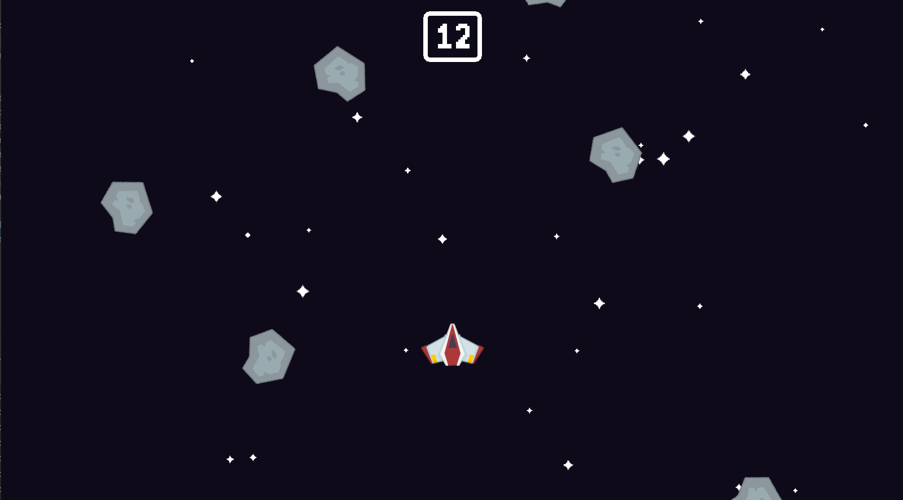
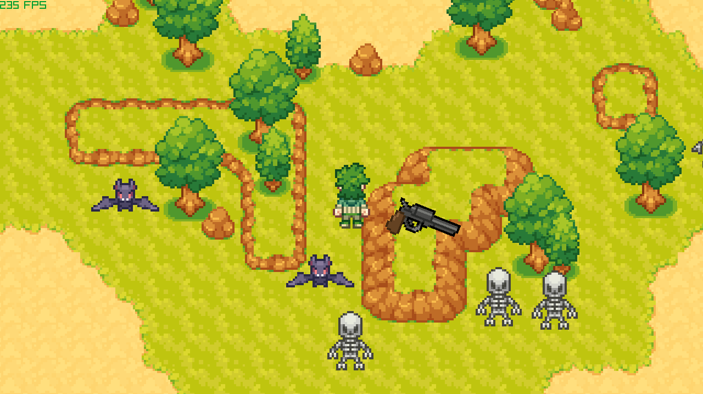
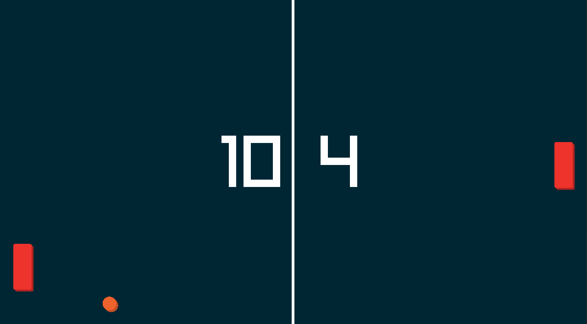
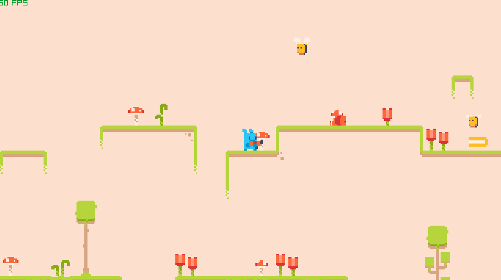

# Master Python by Making 5 Games: The New Ultimate Introduction to Pygame (Remade in Raylib)

This repository contains 4 out of 5 games from this tutorial: [YouTube Tutorial](https://youtu.be/8OMghdHP-zs), **remade using Raylib with Python bindings**. Made only for learning purpose. I didn't bother with audio.

---
## How to Run any of the games

Simply run `main.py` in any Python-compatible IDE or in your terminal:
```bash
python main.py
```

## Space Shooter

**Controls:**
- `Arrow Keys` — Move
- `Space` — Shoot
- `F1` — Debug



## Vampire Survivor

**Controls:**
- `Arrow Keys` — Move
- `Left Mouse Button` — Shoot
- `F1` — Debug



## Pong

**Controls:**
- `Up and Down` — Move


## Platformer

**Controls:**
- `Arrow Keys` — Move
- `S` — Shoot
- `F1` — Debug


