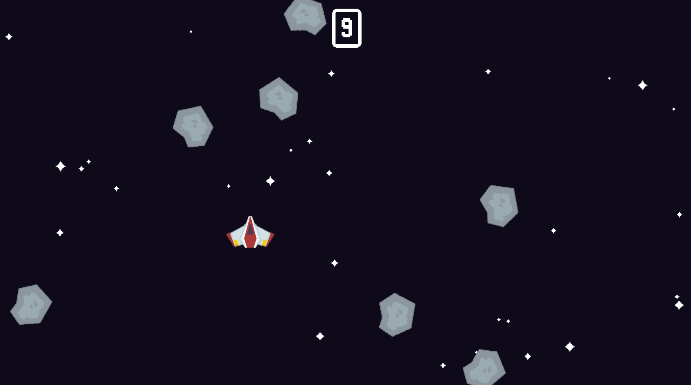

# Master-Python-by-making-5-games-the-new-ultimate-introduction-to-pygame-made-in-raylib
Remade 4 out of 5 games from this tutorial: https://youtu.be/8OMghdHP-zs but in raylib with python language bindings

Space Shooter:
How to run:
  just run file main.py in any IDE that can run python
Controls:
  Arrow keys - movement
  Space - shot

